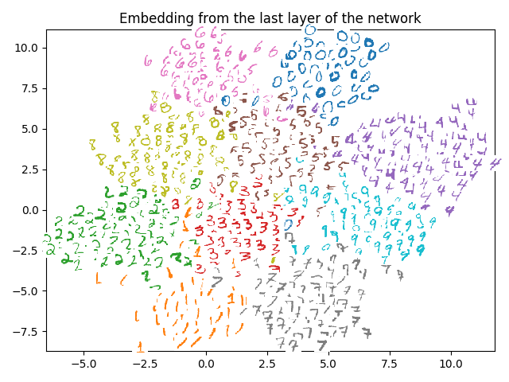

# Implementing Siamese Network using Tensorflow with MNIST

This repositories is forked from [ywpkwon/siamese_tf_mnist](https://github.com/ywpkwon/siamese_tf_mnist).

For this repositories, the **CNN** part is added to this siamese network part. The following picture is the visualization of the testing dataset of mnist after the 100000 training steps.
<p align="center">  </p>

I kept codes minimal for my personal experiments (e.g., different architectures or loss functions).

* `run.py` : nothing but a wrapper for running.
* `inference.py` :  architecture and loss definition. you can modify as you want.
* `visualize.py` : visualizes result.

You can simply run  :

```bash
$ python run.py
```

This will download and extract MNIST dataset (once downloaded, it will skip downloading next time). Once training done, a result will appear as in the image above. It saves an intermediate model regularly (with names `model.*`) while training.

When you run `run.py`, if an model file exists, you will be asked if you want to load it and continue training from that status. `no` will start training from the scratch. 

```bash
$ python run.py
We found model.ckpt file. Do you want to load it [yes/no]? yes
```

For your convenience, while training, embedding results are keeping updated in `embed.txt`. So you can see an resulting embedding anytime (by stopping training or with a separate cmd/shell while training), using

```bash
$ python visualize.py
```


Please let me know if there are mistakes or comments.